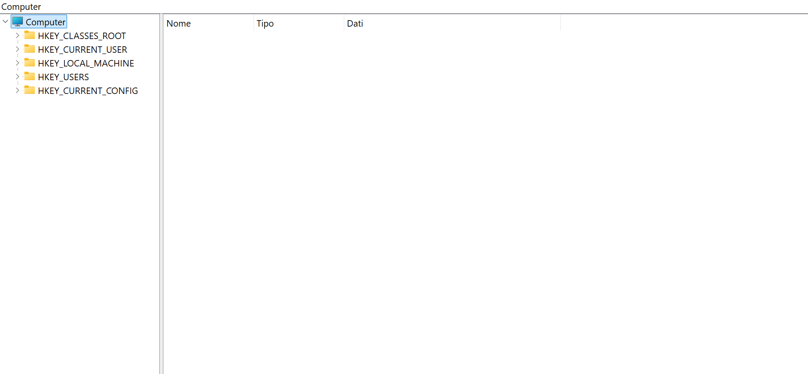
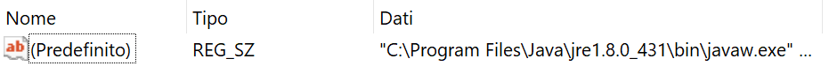
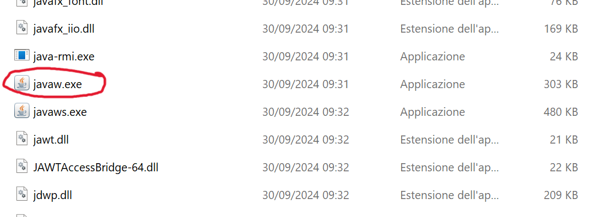
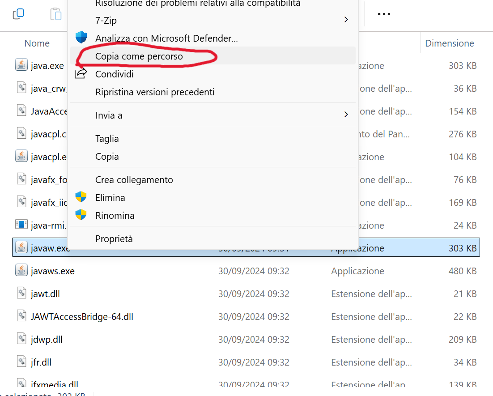
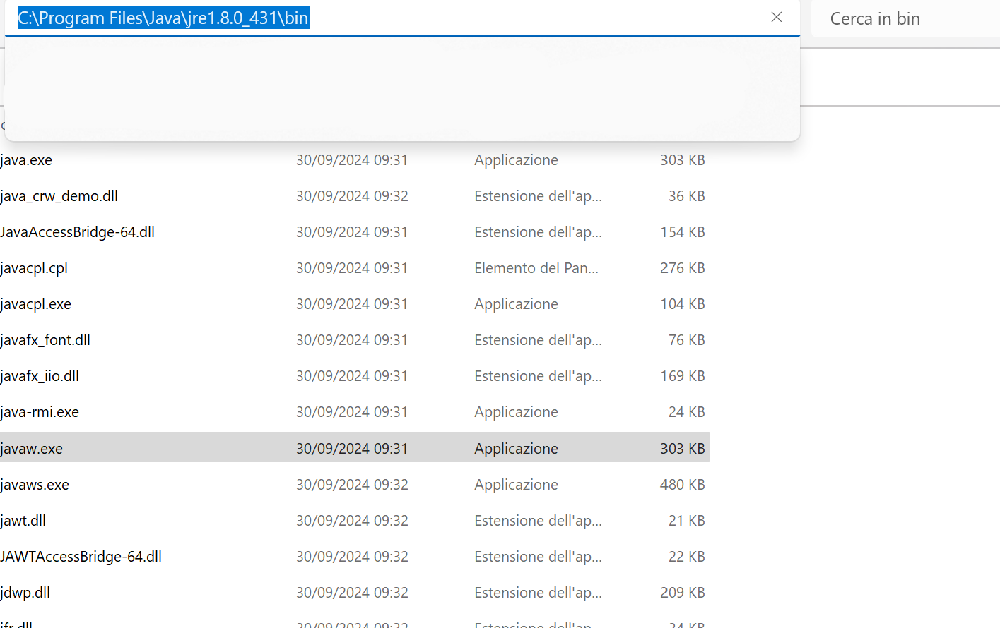
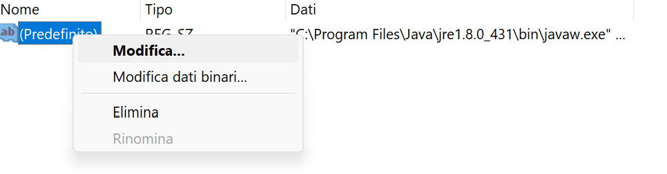
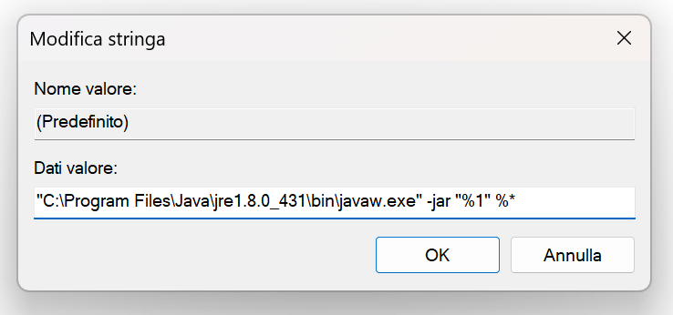

# ItalianDudes Launcher
Un launcher in JavaFX per tutte le applicazioni scritte e sviluppate da ItalianDudes.
L'applicazione richiede Java 8 con JavaFX. In fondo è disponibile la [guida all'installazione di Java 8](#installare-java-8-con-javafx).

# Guida al Download
- Accedere alla pagina di GitHub (se stai leggendo questa guida probabilmente lo hai già fatto).
- Andare in basso a destra dove c'è scritto "Releases" sull'ultima release marcata in verde come "Latest" o attraverso [questo link](https://github.com/ItalianDudes/ID_Launcher/releases/latest) nella pagina dell'ultima release disponibile.
- Qui troverai le informazioni circa l'ultima release dell'ItalianDudes Launcher.
- In fondo troverai la sezione "Assets".
- In "Assets", cliccare sul file chiamato "ID_Launcher" che termina con ".jar".
- Facendo ciò, verrà scaricata la versione dell'ItalianDudes Launcher.
- È altamente consigliato utilizzare l'ItalianDudes Launcher in una sua cartella dedicata, poiché creerà alcuni file e cartelle necessarie al funzionamento.
- Per avviare l'ItalianDudes Launcher segui la guida di seguito.

# Guida all'Avvio
- Prima di pensare di avviare l'app, devi sapere se hai installato sul tuo dispositivo una copia di Java 8 con JavaFX.
- Per installare Java 8 sul tuo dispositivo clicca [qui](#installare-java-8-con-javafx) per accedere alla sezione dedicata.
- Il modo in cui si avvia l'ItalianDudes Launcher cambia da sistema operativo.
- Lista sistemi operativi:
    - [Avviare ItalianDudes Launcher su Windows](#avviare-italiandudes-launcher-su-windows).
    - [Avviare ItalianDudes Launcher su Linux](#avviare-italiandudes-launcher-su-linux).
    - [Avviare ItalianDudes Launcher su MacOS](#avviare-italiandudes-launcher-su-macos).

## Avviare ItalianDudes Launcher su Windows
- Per avviare l'ItalianDudes Launcher su Windows, basterà fare doppio click sull'ItalianDudes Launcher.
- Se facendo doppio click, ed eventualmente aspettando qualche attimo (dipende dalla velocità del computer), non dovesse aprirsi, è possibile che si disponga di versioni multiple di Java installate sul computer.
- È importante sapere che se ci sono più versioni di Java installate sul sistema operativo è possibile che Java 8 non sia quella con cui vengono aperti i Jar.
- Per la guida su come avviare sull'ItalianDudes Launcher su Windows con più installazioni di Java clicca [qui](#avviare-italiandudes-launcher-su-windows-con-multiple-installazioni-di-java).

## Avviare ItalianDudes Launcher su Windows con Multiple Installazioni di Java
- La procedura che segue va a modificare direttamente i Registri di Windows.
- Una modifica errata dei Registri di Windows può comportare instabilità al sistema o il mancato avvio.
- È importante seguire passo passo questa guida e controllare più volte di aver seguito correttamente le istruzioni.
- Digita sulla tastiera la combinazione `WIN + R` (tieni premuto il tasto con l'icona windows e poi premi "R").
- Nella finestra che si aperta digitare `regedit`.
- Apparirà la richiesta di accesso come amministratore.
- Come già detto, questa procedura è molto pericolosa, poiché va ad accedere a una sezione di Windows molto importante in cui risiedono, oltre a ciò che interessa a noi, tutte le informazioni sul corretto funzionamento di Windows.
- Se non si è amministratori del sistema, non è possibile continuare questa guida, ed è eventualmente consigliabile contattare l'amministratore.
- Detto questo, una volta esser entrati nei Registri di Windows, dovrebbe apparire questa interfaccia.
- Seguendo il menu ad albero navigando nelle cartelle, dirigersi al seguente percorso `Computer\HKEY_CLASSES_ROOT\jarfile\shell\open\command`.
- Se si riesce poiché mancano delle cartelle o delle voci, **FERMARSI IMMEDIATAMENTE**.
- Raggiunto questo percorso, sulla destra, apparirà questo file.
- In "Dati", il contenuto potrebbe differire da ciò che è mostrato nell'immagine.
- Adesso, aprire l'Esplora File di Windows, e recarsi a questo percorso: "C:\Program Files\Java".
- Se non in "Program Files" non si trova la cartella "Java", provare questo percorso: "C:\Program Files (x86)\Java".
- Se neanche questo percorso esiste, Java non è stato installato nel sistema operativo, e si consiglia di ri-eseguire la [procedura di installazione di Java per Windows](#installare-java-8-su-windows).
- Se la cartella "Java" è stata trovata, al suo interno potrebbero trovarsi più cartelle.
- Quella che interessa a noi è quella che nel nome contiene una di queste righe "jre-1.8", "jre-8", "jre-1.8".
- Se non è stata trovata, Java 8 non è stato installato nel sistema operativo e si consiglia di ri-eseguire la [procedura di installazione di Java per Windows](#installare-java-8-su-windows).
- Se si è trovata la cartella, aprirla e accedere al suo interno alla cartella "bin".
- Da qui trovare un file chiamato "javaw" o "javaw.exe".
- Una volta trovato, fare tasto destro sull'eseguibile e cliccare su "Copia come Percorso".
- Se questa opzione non esiste, andare nella parte alta della finestra dell'Esplora File, e cliccare sul percorso, fare tasto destro, e copiarlo.
- Adesso avremo nella nostra clipboard di sistema il percorso all'eseguibile di Java 8.
- Tornando a Regedit, fare tasto destro e poi "Modifica" sull'unico file presente, assicurandosi di essere ancora nel percorso `Computer\HKEY_CLASSES_ROOT\jarfile\shell\open\command`.
- Si aprirà una finestra con "Modifica Stringa", e un campo di testo modificabile chiamato "Dati Valore".
- In "Dati Valore" dovremo inserire il nostro percorso di javaw copiato precedentemente cliccando tasto destro e facendo "Incolla".
- Il percorso incollato dovrebbe assomigliare a `"C:\Program Files\Java\jre-1.8\bin\javaw.exe"` con differenze sono in "Program Files" o "Program Files (x86)" e in "jre-1.8" una delle sue possibili varianti.
- Assicurarsi che il percorso incollato sia racchiuso tra doppie virgolette.
- Fatto ciò, aggiungere dopo il percorso incollato (separato da uno spazio) ciò che segue `-jar "%1" %*`.
- Il risultato finale dovrebbe essere simile all'immagine sopra.
- Fatto ciò cliccare su OK.
- Chiudere l'Editor del Registro di Sistema e provare ad'eseguire l'ItalianDudes Launcher con il doppio click.
- In alcuni casi, potrebbe essere necessario riavviare il computer per applicare effettivamente la modifica al registro di sistema.
- Se neanche riavviando il computer l'ItalianDudes Launcher si avvia, apri un report al seguente [link](https://github.com/ItalianDudes/ID_Launcher/issues).

## Avviare ItalianDudes Launcher su Linux
- Per avviare l'ItalianDudes Launcher su Linux ci sono 2 modi:
    - Terminale
    - Abilitazione Esecuzione
- Per eseguire l'ItalianDudes Launcher da terminale dirigersi col terminale nella cartella dell'ItalianDudes Launcher ed eseguire il comando `java -jar ID_LAUNCHER` dove "ID_LAUNCHER" è il nome del file dell'ItalianDudes Launcher da voi scaricato.
- Tuttavia potrebbe essere noioso farlo ogni volta, per cui su alcune distro linux è possibile cliccare tasto destro sull'ItalianDudes Launcher, andare sulle proprietà e mettere la spunta sulla voce che permette l'avvio come eseguibile.
- Se funziona, dopo aver messo la spunta e aver applicato la modifica, basterà fare doppio click sull'ItalianDudes Launcher per eseguirlo.

## Avviare ItalianDudes Launcher su MacOS
- Per avviare l'ItalianDudes Launcher su MacOS l'unica alternativa e quella di aprire il terminale nella cartella dell'ItalianDudes Launcher ed eseguire il comando `java -jar ID_LAUNCHER` dove "ID_LAUNCHER" è il nome del file dell'ItalianDudes Launcher da voi scaricato.
- MacOS per via delle sue politiche stringenti chiederà ogni volta la conferma per l'avvio dicendo che il jar non dispone di una firma valida, questo perché Apple pretende che gli sviluppatori paghino una firma per "garantire" che il file non sia una minaccia.
- Se non te la senti di fornire il consenso poiché l'ItalianDudes Launcher non dispone di una firma valida non eseguirlo.

# Installare Java 8 con JavaFX
- In base al sistema operativo in cui ti trovi, la procedura di installazione cambia.
- Nelle varie procedure non è specificato JavaFX perché tutte le versioni di Java 8 standard includono già al loro interno JavaFX.
- Lista sistemi operativi:
    - [Installare Java 8 su Windows](#installare-java-8-su-windows).
    - [Installare Java 8 su Linux con "apt"](#installare-java-8-su-linux-con-apt).
    - [Installare Java 8 su Linux con "pacman"](#installare-java-8-su-linux-con-pacman).
    - [Installare Java 8 su MacOS (GUIDA SUL SITO DI JAVA)](https://www.java.com/it/download/help/mac_install.html).

## Installare Java 8 su Windows
- Per scaricare java 8 su Windows servirà recarsi al [link di download di Java 8](https://www.java.com/it/download/manual.jsp).
- Accedendo alla pagina, basterà scendere in basso e si troverà la tabella "Windows" con i relativi installer.
- La versione da scaricare dipenderà dall'architettura del tuo computer, ovvero se è una macchina a 32bit o a 64bit.
- A meno che il tuo computer sia **molto** vecchio, sarà a 64bit.
- Per scoprire se l'architettura è a 32 o 64 bit:
    - Digita sulla tastiera la combinazione `WIN + R` (tieni premuto il tasto con l'icona windows e poi premi "R").
    - Nella finestra che si aperta digitare `msinfo32`.
    - Si aprirà il pannello con le informazioni di sistema.
    - Nel menu ad albero a sinistra, cliccare su "Risorse di Sistema" (in inglese "System Summary").
    - A destra ora, cercare la voce "Tipo di Sistema" (in inglese "System Type").
- Se il tuo sistema è a 64bit, scaricare la versione "Windows Offline (64-bit)" (nel sito italiano c'è scritto "Windows non in linea (64 bit)").
- Se il tuo sistema è a 32bit, scaricare la versione "Windows Offline" (nel sito italiano c'è scritto "Windows non in linea").
- Scaricato l'installer, eseguirlo come un qualunque programma di Windows e completare l'installazione.
- Se non ci sono errori, avrai scaricato correttamente Java 8 sul sistema operativo.
- Per la guida su come avviare l'ItalianDudes Launcher clicca [qui](#guida-allavvio).

## Installare Java 8 su Linux con "apt"
- Se devi installare Java 8 su un sistema operativo con "apt" come package manager, probabilmente non ti serve questa guida.
- Apri il terminale.
- Prima di installare Java verifica se hai già Java 8 installato.
- Per fare ciò digita su terminale `java -version`.
- Se "java" non è stato trovato, non è presente una versione di java indicizzata sul tuo sistema operativo.
- Se invece ottieni una risposta, verifica che mostri una versione di Java 8, e non un'altra versione.
- Se non è stato trovato, oppure la versione installata non è quella corretta, continua a seguire questa guida.
- Prima di installare Java, eseguiamo prima un comando di routine per aggiornare le repository: `sudo apt-get update`.
- Ora cerchiamo quali versioni di Java 8 possiamo scaricare attraverso il comando `sudo apt list openjdk-8*`.
- Probabilmente troverai tra le varie versioni disponibili una chiamata `openjdk-8-jre`, ci interessa quella.
- Per scaricarla ora esegui il comando `sudo apt-get install openjdk-8-jre`.
- Se non ci sono errori, avrai scaricato correttamente Java 8 sul sistema operativo.
- Per la guida su come avviare l'ItalianDudes Launcher clicca [qui](#guida-allavvio).

## Installare Java 8 su Linux con "pacman"
- DISCLAIMER: non ho mai usato un sistema Linux con "pacman" come package manager, le seguenti istruzioni sono state ricavate dal web e poi controllate al fine di usare solo link di download ufficiali e comandi non ambigui.
- Se devi installare Java 8 su un sistema operativo con "pacman" come package manager, probabilmente non ti serve questa guida.
- Apri il terminale.
- Prima di installare Java verifica se hai già Java 8 installato.
- Per fare ciò digita su terminale `java -version`.
- Se "java" non è stato trovato, non è presente una versione di java indicizzata sul tuo sistema operativo.
- Se invece ottieni una risposta, verifica che mostri una versione di Java 8, e non un'altra versione.
- Se non è stato trovato, oppure la versione installata non è quella corretta, continua a seguire questa guida.
- Prima di installare Java, controlliamo che versioni di Java sono disponibili attraverso il comando `sudo pacman -sS java | grep jre8`.
- In teoria, dovresti trovare una versione chiamata `jre8-openjdk`, scaricheremo quella.
- Per scaricare quella versione, esegui `sudo pacman -S jre8-openjdk`.
- Se non ci sono errori, avrai scaricato correttamente Java 8 sul sistema operativo.
- Per la guida su come avviare l'ItalianDudes Launcher clicca [qui](#guida-allavvio).